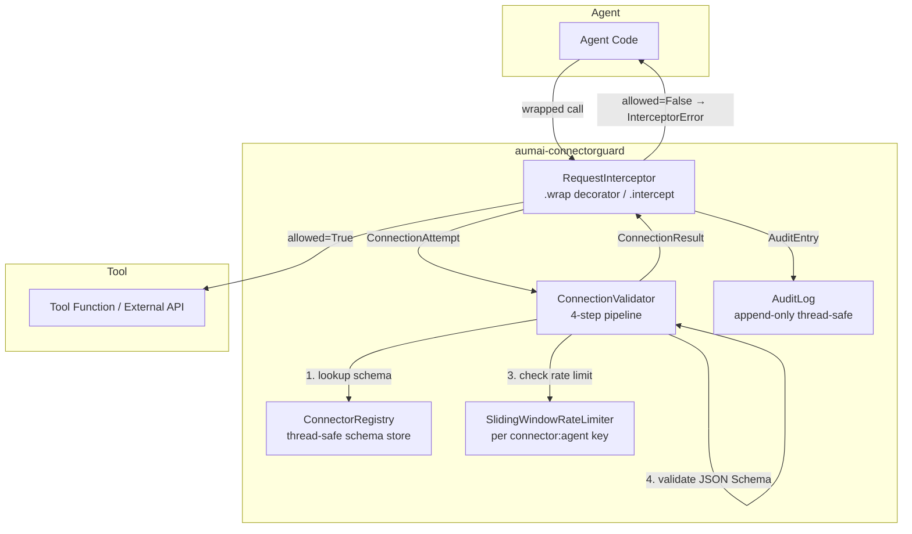

# AumAI ConnectorGuard

> Runtime validation for agent-to-tool connections

[](https://github.com/aumai/aumai-connectorguard/actions)
[](https://pypi.org/project/aumai-connectorguard/)
[](LICENSE)
[](https://python.org)

---

## What is this?

When an AI agent wants to use a tool — call an API, write a file, query a database — it
sends a connection attempt: a request saying "I am agent X, I want to call tool Y with
these inputs." Without any checks, the agent can call any tool it knows about, with any
inputs, as many times as it wants.

`aumai-connectorguard` is the **bouncer** standing at the door of every tool. Before a
call gets through, it checks four things in sequence:

1. **Is this tool registered?** (Does it exist in the connector registry?)
2. **Does the agent hold the required permissions?** (Capability token check)
3. **Is the agent within its rate limit?** (Sliding-window counter per agent per connector)
4. **Does the input match the tool's schema?** (JSON Schema validation of the payload)

If any check fails, the call is blocked and a detailed reason is returned. Every call —
allowed or denied — is written to an append-only audit log.

**Non-developer analogy:** Imagine a company where every employee (agent) has a badge with
specific access levels. A connector is a door to a system such as the payroll API. The
bouncer checks the badge, verifies the employee has not already badged in too many times
today, checks that they are carrying the right form (correct input schema), and only then
lets them through — recording every attempt in a tamper-evident logbook.

---

## Why does this matter?

### The implicit trust problem

Modern agentic systems connect LLMs to dozens of tools. Each tool is a potential attack
surface: a poorly-prompted agent might call a destructive endpoint, pass malformed data
that causes downstream errors, or hammer a paid API at 1,000 requests per minute. Without
a validation layer between the agent and its tools, every tool integration is an implicit
trust relationship.

`aumai-connectorguard` makes that trust relationship **explicit and auditable**:

- You declare what each tool accepts (JSON Schema) and who can call it (permissions).
- The validator enforces those declarations at runtime, not at design time.
- Every call is logged, giving you a forensic trail for debugging and compliance.

### What aumai-connectorguard adds

| Without connectorguard | With aumai-connectorguard |
|---|---|
| Any agent can call any tool | Permission tokens required per connector |
| No input validation | JSON Schema enforced on every call |
| No rate limiting | Sliding-window rate limiter per agent per connector |
| No audit trail | Append-only AuditLog queryable by agent, connector, or time |
| Tool errors are opaque | Denied calls explain exactly which check failed and why |

---

## Architecture



---

## Features

**ConnectorRegistry** — Thread-safe registry for `ConnectorSchema` objects keyed by name.
Supports `register`, `get`, `unregister`, and `all_names`.

**ConnectionValidator — 4-step Pipeline** — Validates a `ConnectionAttempt` through
connector existence, permission check, rate limit check, and JSON Schema validation.
Short-circuits on first failure with a human-readable reason.

**SlidingWindowRateLimiter** — Per-connector sliding-window counter backed by a UTC
timestamp deque. Stale entries are evicted before each check, eliminating the boundary
burst problem of fixed-window counters.

**AuditLog** — Append-only, thread-safe log with a configurable capacity cap (default
10,000 entries). Query by connector, agent, time window, or filter to denied entries.

**RequestInterceptor** — Decorator factory that wraps any callable with pre-call
validation and automatic audit logging. Also provides a manual `intercept()` method for
post-dispatch recording.

**CLI Tools** — `register` (persist schema to local file), `watch` (validate JSON
connection log files), `audit` (query persistent audit log with time filtering).

---

## Quick Start

### Install

```bash
pip install aumai-connectorguard
```

### Define a connector schema

Create a JSON file describing the tool contract:

```json
{
  "name": "openai-chat",
  "version": "1.0.0",
  "rate_limit": 30,
  "required_permissions": ["llm:call"],
  "input_schema": {
    "type": "object",
    "properties": {
      "prompt": {"type": "string"},
      "model":  {"type": "string"}
    },
    "required": ["prompt"]
  },
  "output_schema": {"type": "object"}
}
```

### Register it via CLI

```bash
aumai-connectorguard register --schema openai-chat.json
# Registered connector 'openai-chat' v1.0.0 -> .connectorguard_registry.json
```

### Python — validate a call in 5 lines

```python
from aumai_connectorguard import (
    ConnectorRegistry, ConnectorSchema, ConnectionAttempt, ConnectionValidator
)

registry = ConnectorRegistry()
registry.register(ConnectorSchema(
    name="openai-chat",
    version="1.0.0",
    required_permissions=["llm:call"],
    input_schema={"type": "object", "required": ["prompt"]},
))

validator = ConnectionValidator(registry, agent_permissions={"agent-1": ["llm:call"]})
attempt = ConnectionAttempt(
    connector_name="openai-chat",
    source_agent="agent-1",
    input_data={"prompt": "Summarize this document."},
)
result = validator.validate(attempt)
print(result.allowed, result.reason)  # True  all checks passed
```

### Use the decorator interceptor

```python
from aumai_connectorguard import (
    AuditLog, ConnectorRegistry, ConnectorSchema,
    ConnectionValidator, RequestInterceptor,
)

registry = ConnectorRegistry()
registry.register(ConnectorSchema(name="calculator", version="1.0.0"))

interceptor = RequestInterceptor(ConnectionValidator(registry), AuditLog())

@interceptor.wrap(connector_name="calculator", source_agent="agent-1")
def add(x: int, y: int) -> int:
    return x + y

print(add(x=3, y=4))                 # 7 — validated, executed, logged
print(len(interceptor.audit_log))    # 1
```

---

## CLI Reference

### `aumai-connectorguard register`

Register a connector schema from a JSON file into a local registry file. The registry
file is created if it does not exist, and updated (merge) if it does.

```
Usage: aumai-connectorguard register [OPTIONS]

Options:
  --schema PATH           Path to connector schema JSON file.  [required]
  --registry-file PATH    Local registry state file.
                          [default: .connectorguard_registry.json]
  --help                  Show this message and exit.
```

**Examples:**

```bash
aumai-connectorguard register --schema connectors/openai-chat.json
aumai-connectorguard register --schema connectors/db-query.json \
    --registry-file prod_registry.json
```

### `aumai-connectorguard watch`

Read all `*.json` files in an agent directory, parse them as `ConnectionAttempt` objects
(or arrays of them), and validate each against registered connectors.

```
Usage: aumai-connectorguard watch [OPTIONS]

Options:
  --agent PATH            Agent directory to scan.  [required]
  --registry-file PATH    Local registry state file.
                          [default: .connectorguard_registry.json]
  --agent-id TEXT         Agent identifier for permission/rate-limit checks.
                          [default: watched-agent]
  --help                  Show this message and exit.
```

**Example output:**

```
  [ALLOW] openai-chat (agent=watched-agent) — all checks passed
  [DENY ] db-write    (agent=watched-agent) — agent 'watched-agent' is missing
          required permissions: db:write

Processed 2 attempt(s): 1 allowed, 1 denied.
```

### `aumai-connectorguard audit`

Display recent entries from the persistent audit log file with flexible time filtering.

```
Usage: aumai-connectorguard audit [OPTIONS]

Options:
  --since TEXT           Time window: <number>[s|m|h], e.g. 30m, 2h, 3600s.
                         [default: 1h]
  --output [text|json]   Output format.  [default: text]
  --log-file PATH        Persistent audit log file.
                         [default: .connectorguard_audit.json]
  --help                 Show this message and exit.
```

**Examples:**

```bash
# Last hour of activity
aumai-connectorguard audit

# Last 30 minutes as JSON for programmatic processing
aumai-connectorguard audit --since 30m --output json

# Last 24 hours from a named log
aumai-connectorguard audit --since 24h --log-file /var/log/agent_audit.json
```

---

## Python API Examples

### Grant and revoke permissions dynamically

```python
validator = ConnectionValidator(registry)

validator.grant_permission("agent-1", "llm:call")
validator.grant_permission("agent-1", "db:read")

# Revoke when access should be removed
validator.revoke_permission("agent-1", "db:read")
```

### Query the audit log

```python
import datetime
from aumai_connectorguard import AuditLog

log = AuditLog(max_entries=50_000)

# ... entries accumulate during operation ...

all_entries      = log.all_entries()
recent           = log.since(datetime.datetime.now(datetime.UTC)
                             - datetime.timedelta(hours=1))
openai_entries   = log.for_connector("openai-chat")
agent_entries    = log.for_agent("agent-1")
denied_entries   = log.denied_entries()

print(f"Total: {len(log)}, Denied: {len(denied_entries)}")
```

### Manual intercept (post-dispatch recording)

```python
result = interceptor.intercept(
    connector_name="openai-chat",
    input_data={"prompt": "hello"},
    source_agent="agent-2",
)
if not result.allowed:
    print(f"Blocked ({result.latency_ms:.1f}ms): {result.reason}")
```

### Sliding window rate limiter standalone

```python
from aumai_connectorguard import SlidingWindowRateLimiter, check_rate_limit

limiter = SlidingWindowRateLimiter()

for i in range(5):
    allowed = limiter.check_rate_limit(
        connector="openai-chat:agent-1",
        window_seconds=60,
        max_requests=3,
    )
    print(f"call {i+1}: {'allowed' if allowed else 'denied'}")
# call 1: allowed  call 2: allowed  call 3: allowed
# call 4: denied   call 5: denied

print(limiter.current_count("openai-chat:agent-1", window_seconds=60))  # 3
limiter.reset("openai-chat:agent-1")

# Module-level convenience uses a shared global limiter
print(check_rate_limit("my-connector", window_seconds=60, max_requests=10))  # True
```

---

## Configuration Options

### `ConnectorSchema` fields

| Field | Type | Default | Description |
|---|---|---|---|
| `name` | `str` | required | Unique connector identifier |
| `version` | `str` | required | SemVer string |
| `input_schema` | `dict` | `{}` | JSON Schema for input; empty = skip validation |
| `output_schema` | `dict` | `{}` | JSON Schema for output (informational) |
| `rate_limit` | `int` | `60` | Maximum requests per minute |
| `required_permissions` | `list[str]` | `[]` | Permission tokens agents must hold |

### `ConnectionValidator` constructor options

| Parameter | Type | Default | Description |
|---|---|---|---|
| `registry` | `ConnectorRegistry` | required | Schema lookup source |
| `rate_limiter` | `SlidingWindowRateLimiter \| None` | `None` | Custom limiter; creates one if None |
| `agent_permissions` | `dict[str, list[str]] \| None` | `None` | Initial permission map |
| `rate_limit_window_seconds` | `int` | `60` | Sliding window size in seconds |

### `AuditLog` constructor options

| Parameter | Type | Default | Description |
|---|---|---|---|
| `max_entries` | `int` | `10_000` | Maximum entries before oldest are evicted |

---

## How it works — Technical Deep-Dive

### Validation pipeline

`ConnectionValidator.validate()` is a short-circuit pipeline. Each step creates and
returns a `ConnectionResult(allowed=False, reason=...)` immediately if the check fails.
All four passing produces `ConnectionResult(allowed=True, reason="all checks passed")`.
`time.monotonic()` measures latency in milliseconds and records it on every result.

### Rate limiting — sliding window

The `SlidingWindowRateLimiter` uses a `collections.deque` per connector key
(`connector_name:source_agent`). On each call, stale timestamps older than
`window_seconds` are evicted from the left, then the remaining count is checked against
`max_requests`. If under the limit, the current UTC timestamp is appended and `True` is
returned. This avoids the boundary burst problem of fixed-window counters.

### JSON Schema validation

Input validation uses the `jsonschema` library. If `input_schema` is an empty dict, the
step is skipped entirely. Schema definition errors are caught and surfaced as validation
failures rather than exceptions, ensuring the pipeline never crashes on a badly defined
schema.

### RequestInterceptor

`RequestInterceptor.wrap()` is a decorator factory using `functools.wraps`. Positional
arguments are captured as `arg_0`, `arg_1`, etc. in the `input_data` payload. The wrapper
calls `validate()`, appends an `AuditEntry` regardless of outcome, then either calls the
original function or raises `InterceptorError` with the denial reason.

### Thread safety

All classes are thread-safe. `ConnectorRegistry`, `ConnectionValidator`, and `AuditLog`
use `threading.Lock`. `SlidingWindowRateLimiter` uses a single lock for the entire
`_windows` dict.

---

## Integration with other AumAI projects

- **aumai-sandbox** — Pair connector validation with sandboxed execution. Validate the
  tool call before dispatch, then execute inside a sandbox with resource limits.
- **aumai-specs** — Express `ConnectorSchema` contracts in agent specifications to
  generate validation configurations automatically.
- **aumai-registry** — Store connector schemas in a central registry and hydrate a local
  `ConnectorRegistry` from it at agent startup.

---

## Contributing

We welcome contributions. Please read `CONTRIBUTING.md` for the full guide.

Quick steps:

1. Fork the repository.
2. Create a feature branch: `git checkout -b feature/my-change`
3. Install dev dependencies: `pip install -e ".[dev]"`
4. Run the test suite: `pytest`
5. Open a pull request against `main`.

All Python code must pass `ruff` and `mypy --strict`. Tests are required for all new
public APIs.

---

## License

Apache License 2.0 — see `LICENSE` for the full text.

## Part of AumAI

This project is part of [AumAI](https://github.com/aumai) — open source infrastructure
for the agentic AI era.
